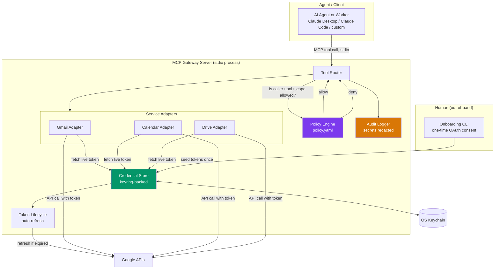
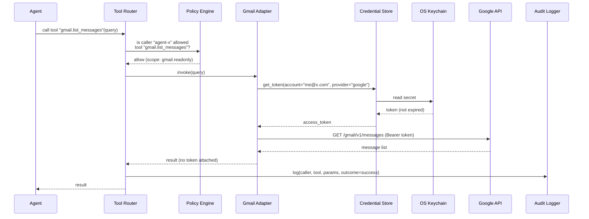
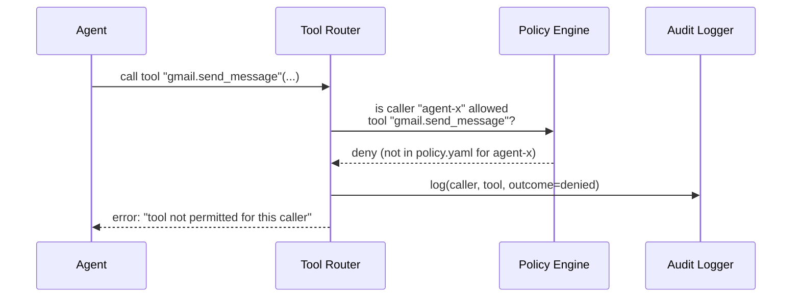
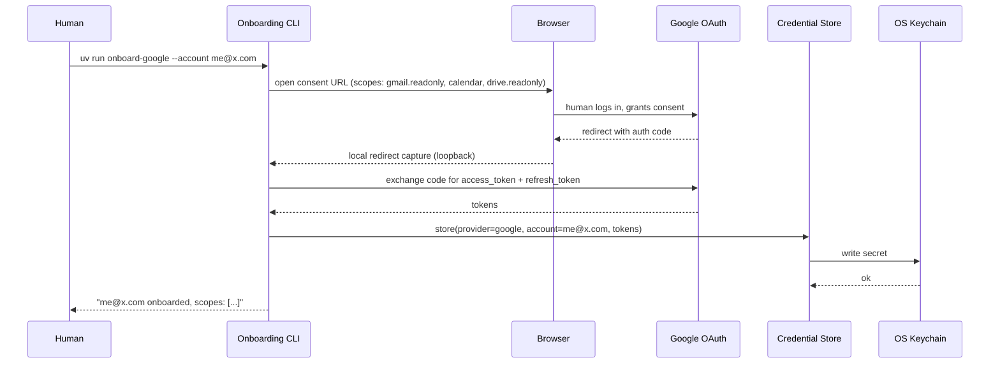
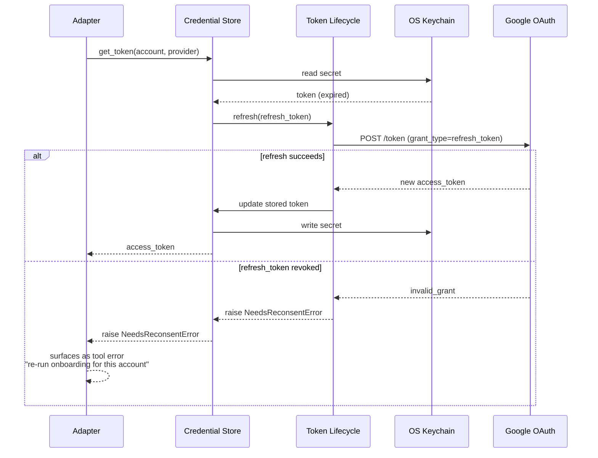

# jb_gateway_mcp — Design

An MCP server that acts as a credential-holding gateway to external APIs. AI
agents/workers call MCP tools; the server holds all secrets (OAuth tokens,
API keys) and decides what's allowed. Agents never see, request, or handle
credentials.

## Goals / non-goals

**Goals**
- Agents authenticate to *this server* only (implicitly, via being an
  allowed local MCP client) — never to Google, banks, etc. directly.
- Every external call is mediated by a deny-by-default policy check.
- Every external call is audited (who/what/when), with secrets redacted.
- Adding a new provider is a new adapter module, not a core rewrite.

**Non-goals (v1)**
- No networked/multi-host transport (stdio only for now).
- No write/transfer capability for financial services — read-only or not
  integrated at all.
- No runtime human-approval step — authorization is static policy only.

## Locked decisions

| Area | Decision |
|---|---|
| Transport | Local stdio; core kept transport-agnostic |
| MVP scope | Google APIs (Gmail, Calendar, Drive) |
| Financial services | Later phase, read-only only |
| Credential storage | OS keychain via `keyring` |
| Authorization | Static policy file, deny-by-default, no runtime approval |

---

## Architecture



**Key property:** tokens flow only between `Credential Store`, `OS Keychain`,
`Token Lifecycle`, and the `Adapters` internally. Nothing in that loop ever
appears in a tool response, a log line, or crosses back to the `Agent`.

---

## Flow 1 — Tool call (steady state, authorized)



## Flow 2 — Tool call denied by policy



No adapter is ever invoked on a deny — the credential store is never touched.

## Flow 3 — OAuth onboarding (one-time, human-driven)



This CLI is never invoked by an agent — it's a separate entrypoint a human
runs interactively. Agents only ever see the *result* (tools become usable),
never the flow itself.

## Flow 4 — Token refresh (automatic, inside a tool call)



Failure mode is explicit and fails closed — never falls back to an
unauthenticated or cached-stale call.

---

## Repo layout

```
src/jb_gateway_mcp/
    server.py              # MCP server entrypoint, stdio transport, tool registration
    router.py               # dispatches tool calls -> policy check -> adapter
    policy.py                # loads policy.yaml, allow/deny decisions
    credentials.py            # keyring-backed store: get/put/refresh
    token_lifecycle.py         # refresh logic, NeedsReconsentError
    audit.py                    # structured JSONL logger, redaction
    adapters/
        base.py                   # shared ToolSpec + Google API client builder
        google_gmail.py             # list/read/send
        google_calendar.py          # list/create events
        google_drive.py             # list/read files
    cli/
        onboard_google.py          # OAuth consent flow entrypoint
        uninstall.py                # revoke grant + delete keychain token, per account
tests/
    (mirrors src/ layout)
scripts/
    start.sh                # launches the server; every client config points here
config/
    claude_desktop_config.example.json
    mcp_client_generic.example.json
.claude/skills/
    run-jb-gateway-mcp/       # project skill: spawn + drive a real MCP session to verify the server
.mcp.json                  # active Claude Code project config
policy.yaml
pyproject.toml
README.md                  # step-by-step setup/usage/configuration guide (start here to run it)
```

---

## Setup & usage (as-built)

This section summarizes what's actually running today; **[README.md](README.md)
is the maintained, step-by-step version** — treat it as authoritative if
anything here drifts.

1. **Install**: `uv sync` (Python 3.13, managed by `uv`).
2. **Create a Google OAuth client** once, in Google Cloud Console (Desktop
   app type, Gmail/Calendar/Drive APIs enabled) — produces a
   `client_secret.json` you keep outside the repo.
3. **Onboard an account** (one-time, human-run, opens a browser):
   ```bash
   uv run onboard-google --account you@example.com \
     --client-secrets ~/.secrets/jb_gateway_mcp/client_secret.json
   ```
   Defaults to read-only Gmail/Calendar/Drive scopes; pass `--scopes`
   explicitly to also grant `gmail.send` / `calendar.events`.
4. **Grant policy access** — edit `policy.yaml` (deny-by-default; nothing
   works until a caller has an explicit `allow` entry there).
5. **Run it** via `./scripts/start.sh` — resolves the project root, checks
   `uv`/`policy.yaml` are present, and `exec`s into `uv run jb-gateway-mcp`
   so a launching client's process lifecycle reaches the real server
   directly. Every client config below points at this script, not at `uv`
   directly.
6. **Connect a client** — all use the same `JB_GATEWAY_CALLER_ID=local`
   (single-user, local deployment; see the Policy model section above for
   why one shared caller id is intentional here, not a shortcut):
   - **Claude Code** — [`.mcp.json`](.mcp.json) at the repo root, picked up
     automatically when the folder is opened.
   - **Claude Desktop** — copy
     [`config/claude_desktop_config.example.json`](config/claude_desktop_config.example.json)
     into `claude_desktop_config.json`, with an absolute path to
     `scripts/start.sh`.
   - **Other MCP clients** (Cursor, Windsurf, Cline, etc.) — same
     `mcpServers` shape, see
     [`config/mcp_client_generic.example.json`](config/mcp_client_generic.example.json).
7. **Verify it's working** — `.claude/skills/run-jb-gateway-mcp/` is a
   project skill that spawns the real server via `scripts/start.sh` and
   drives a real MCP session against it (handshake, tool discovery, `ping`,
   policy-gated tool calls, audit log integrity check):
   ```bash
   uv run python .claude/skills/run-jb-gateway-mcp/scripts/smoke_test.py
   ```

Full tool catalog, environment variable reference, and troubleshooting are
in [README.md](README.md).

**Network:** the gateway itself binds no port and exposes no URL — it's
stdio-only, reachable only as a subprocess of the client that launched it
(matches the "Locked decisions" transport row above). The single exception
is `onboard-google`, which briefly opens a local OAuth-redirect listener on
`localhost:8080` for the duration of that one command only. See
[README.md "Network & ports"](README.md) for details.

**Uninstalling:** deleting the repo directory alone leaves stored OAuth
tokens in the OS keychain and the consent grant active on the Google
account side. `uv run uninstall-google --account you@example.com` handles
both in one step — revokes the grant at Google's token revocation endpoint
(RFC 7009) and deletes the keychain entry, falling back to local-only
deletion with a manual-revoke pointer if the network call fails. See
[README.md "Uninstalling"](README.md) for the full teardown order (remove
from client configs → run `uninstall-google` → delete local state → delete
the repo).

## Policy model (`policy.yaml`)

Deny-by-default. Each caller identity maps to explicit tool + scope grants:

```yaml
callers:
  agent-x:
    allow:
      - tool: gmail.list_messages
        scope: gmail.readonly
      - tool: calendar.list_events
        scope: calendar.readonly
  agent-y:
    allow:
      - tool: gmail.send_message
        scope: gmail.send
```

Caller identity for stdio v1 = the local MCP client config name (process
launched Claude Desktop/Code side); no network auth needed since the OS
process boundary is the trust boundary. This field becomes a real
authenticated identity (API key/mTLS subject) once the networked-transport
phase lands — `router.py`/`policy.py` are written against an abstract
`caller_id: str` so that swap doesn't touch adapters.

## Security notes

- Tokens never appear in: tool responses, audit log entries, exceptions
  surfaced to the agent, or stdout/stderr.
- Audit log redacts by field name (`token`, `refresh_token`, `secret`,
  `authorization`) as a backstop, not just by convention.
- Adapters validate/sanitize all tool parameters at the boundary before
  building API requests (no raw param interpolation into URLs/queries).
- Financial adapters (later phase) are architecturally restricted to
  read-only HTTP verbs at the adapter base-class level, not just by policy
  config — so a policy misconfiguration can't grant a transfer capability
  that doesn't exist in code.

## Phased build order

1. ✅ Scaffolding — `uv init`, MCP server skeleton with one no-op tool, ruff/mypy/pytest wired.
2. ✅ Credential store + Google OAuth onboarding CLI.
3. ✅ Policy engine + audit log, wired into the router before any adapter runs.
4. ✅ Google adapters — Gmail (list/read/send), Calendar (list/create), Drive (list/read).
5. ✅ Tests + hardening — refresh failure paths, policy-deny paths, no-secret-in-logs check,
   plus a startup script, client configs, and a project skill for live verification
   (see "Setup & usage" above).
6. *(Future)* Networked transport (HTTP/SSE) + caller authentication.
7. *(Future)* Financial adapter — read-only, via an aggregator (e.g. Plaid).
